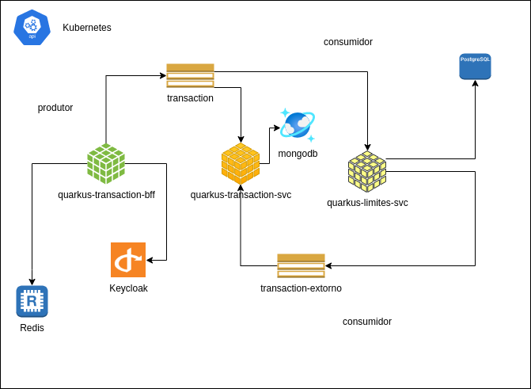

## BFF para proxy de Transações Financeiras.

Para subir local a aplicação executem no terminal ./mvnw compile quarkus:dev

./mvnw quarkus:add-extension -Dextensions="rest-client,rest-client-jackson"

Execução

1) ./mvnw compile quarkus:dev
2) Subir localmente kafka, redis e zipkin
   Executar: docker-compose -f docker-compose-kafka-zipkin.yml up

## Desenho

